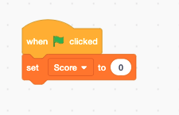
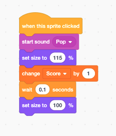
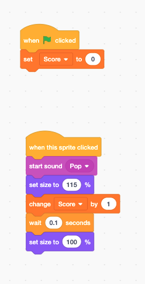

Scratch is a programming language children use to develop programs using block coding.

Below is a tutorial you may use to create a basic clicker game using Scratch 3. Choose a sprite and implement the blocks below to create a clicker game.

 
 
Once you have chosen a sprite, set the score to 0 every time the green flag is clicked (and the game is restarted).
 

 
 
Create a function that executes every time the sprite is clicked. The function below does the following:
<ul>
    <li>Implements a "Pop" sound</li>
    <li>Sets the sprite size to 115% of its normal size</li>
    <li>Increments the score by 1</li>
    <li>Waits 0.1 seconds before returning the sprite size to 100% of its normal size.</li>
</ul>
 

 
 
Below is the full program code, which you will implement on a sprite of your choice. You can copy the code here or download it from <a href="https://github.com/RichardLudwig/ScratchDemos/blob/main/BasicClickerGame.sb3" target="_blank">GitHub</a>.
 
 
